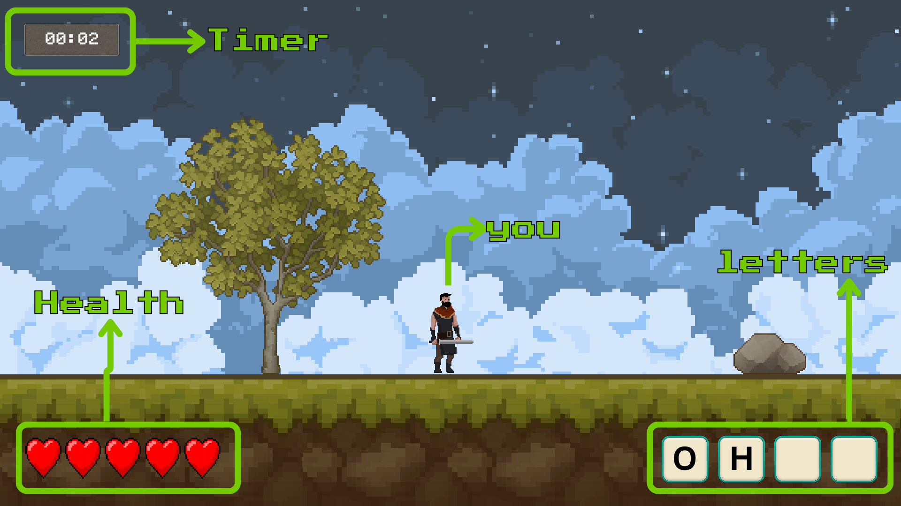
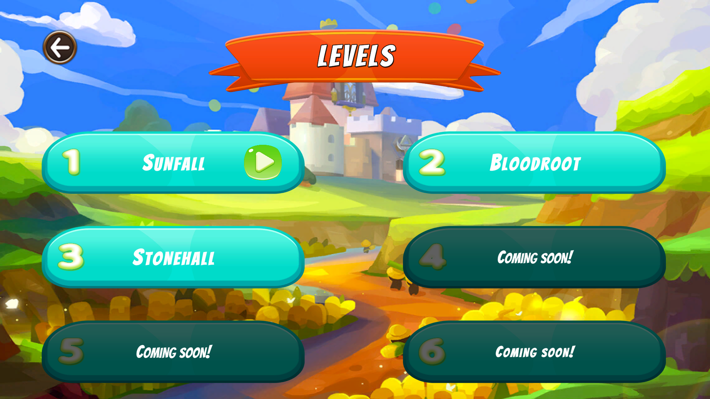
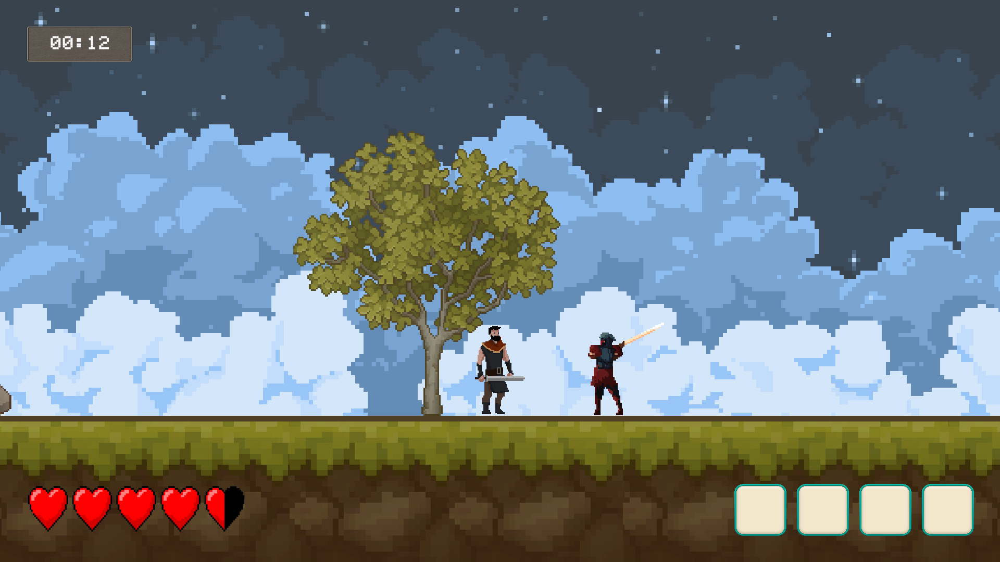
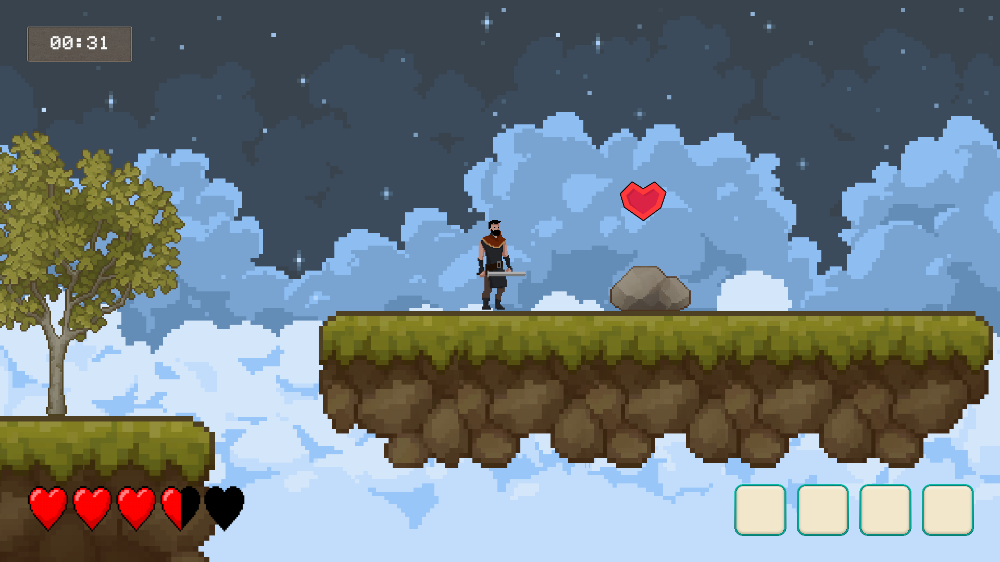
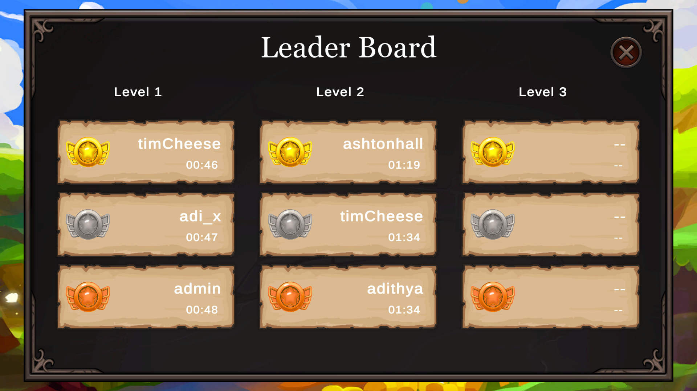
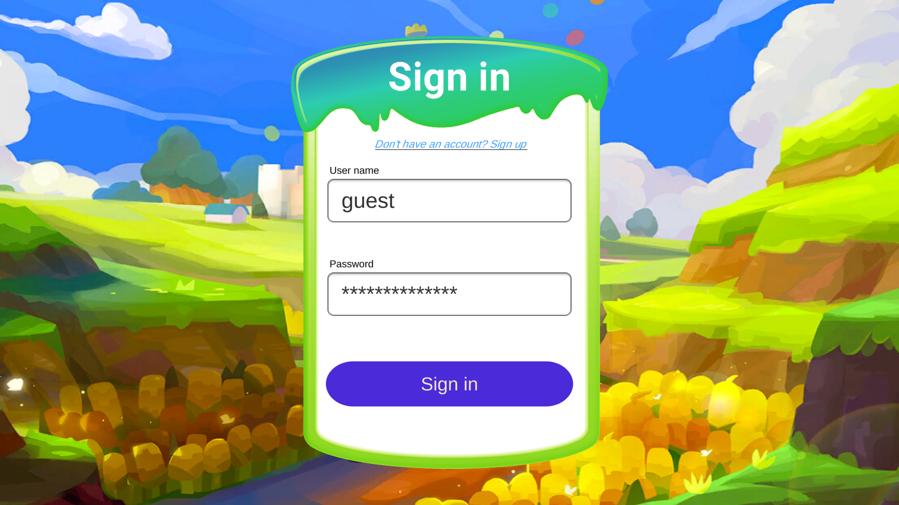

# WordSmith

**WordSmith** is a 2D side-scrolling action platformer where every enemy you defeat drops a letter. Collect all the letters scattered throughout each level, reach the exit, and spell the magic word to unlock your path forward. Fast-paced combat meets word-puzzle mechanics in this unique adventure.

**Demo Version:** v0.1.0  
**Playtime:** ~10–15 minutes  
**Levels Available:** 3 out of 6 planned levels

---

## 🎮 How to Play

### Core Gameplay Loop
Kill enemies → Collect letters → Reach the exit → Form the word → Unlock the next level

*The HUD displays your health, timer, collected letters, and current level progress.*

### Level Selection

*Choose from 3 demo levels. Progress is saved to the cloud automatically.*

### Combat & Survival

*Slash through enemies with your sword. Each defeated foe drops a letter you need to collect.*

*Collect heart pickups scattered throughout levels to restore your health.*

---

## 🏆 Leaderboard

Compete with players worldwide! Your fastest completion times are automatically uploaded to the cloud leaderboard. Track your ranking and challenge yourself to climb to the top.

---

## 🔐 Login System

WordSmith features cloud-based progress saving and leaderboard integration. 

**⚠️ Important Note:** The login button may appear unresponsive for 30–60 seconds on first use. This is due to the backend running on a free hosting plan that experiences "cold start" delays. Please be patient—the system will respond once the server wakes up.

### Demo Login Credentials
For quick testing without creating an account:
- **Username:** `guest`
- **Password:** `guest-pass@123`

---

## 🛠️ Tech Stack

**Game Engine:** Unity 2022.3.40f1  
**Backend:** Node.js + Express  
**Database:** MongoDB Atlas  
**Hosting:** Render.com (Free Tier)  
**Platform:** Windows (.exe)

---

## 📥 Download

**[Download WordSmith Demo v0.1.0](https://github.com/aDiThYa-808/WordSmith/releases)**

1. Download `Wordsmith-Windows-Demo-v0.3.0.zip` from the releases page
2. Extract the ZIP file
3. Run `WordSmith.exe`
4. Log in or use demo credentials
5. Start playing!

**System Requirements:**
- OS: Windows 7 or later
- RAM: 2GB minimum
- Storage: 100MB available space

---

## ⚠️ Known Issues & Limitations

This is an early demo build. Here are the current known issues:

- **Login Delay:** Backend cold start can cause 30–60 second delays on first login
- **Movement:** Slight choppiness in certain areas
- **Combat:** Only 2 sword attack animations available
- **Enemy Variety:** Enemy types repeat across levels
- **Exit Zone:** Once you enter the exit area, you cannot return to the level
- **Content:** Only 3 of 6 planned levels are available in this demo

Your feedback is valuable! Please report any additional bugs or suggestions.

---

## 📋 Version Info

**Current Version:** Demo v0.1.0  
**Release Date:** 2025  
**Build:** Wordsmith-Windows-Demo-v0.3.0

---

## 📧 Contact & Feedback

Found a bug? Have suggestions? Feel free to open an issue or reach out!

**Enjoy the game and happy word-hunting!** ⚔️📝
